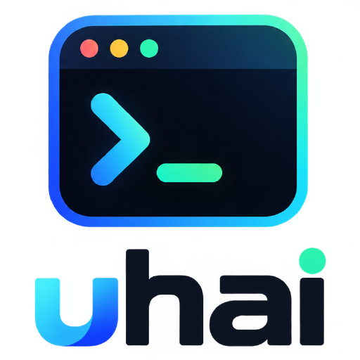

<p align="center">
  <picture>
    <source media="(prefers-color-scheme: dark)" srcset="docs/assets/uhai-cli.png">
    
  </picture>
</p>

<p align="center">
  <em>A coding agent that lives in the terminal.</em>
</p>

It reads and writes your files, runs commands, and asks before doing anything
it cannot take back.

It talks to whichever model you point it at. Two providers ship with an
endpoint — Anthropic and OpenAI — and anything else speaking either format is
one `/connect` away: a gateway, a company endpoint, Gemini, Z.ai, OpenRouter,
Ollama on your own machine. The whole of it is about 14,000 lines of Go
outside the tests, small enough to read in a sitting or two.

## Features

- **Two front ends, one binary.** A full-screen prompt with the input pinned to
  the bottom when a terminal is attached; a prompt-per-line on stdout when
  stdin is a pipe. The same program is the thing you talk to and the thing a
  script calls.
- **Whatever model you point it at.** Anthropic and OpenAI ship with an
  endpoint; anything else speaking either wire format is a name, a base URL and
  a key. Behind a gateway it reads the model that actually *answered* and sizes
  the turn from that, rather than from the alias it was handed.
- **It asks before it changes anything.** The tools that write, run commands or
  leave the machine ask first — an edit shows its diff, a command shows itself.
  `allow`, `ask` and `deny` are per tool in `.uhai/settings.json`, and a chained
  shell line is judged part by part, so allowing `git` does not allow
  `git status && rm -rf /`.
- **Looking things up by meaning, not by spelling.** `find_symbol` asks the
  project's language server where something is defined and who uses it, where
  `grep` can only match the word. `search_web` finds an address and `fetch_url`
  opens it. No language server installed is an answer, not an error.
- **Work that outlives the window.** A daemon holds the conversation and
  `uhai -attach` joins it from anywhere; one daemon serves every project and
  stops itself when nobody is there. Background tasks run in processes of their
  own, so one that crashes takes nothing else with it.
- **Conversations that come back.** Every session is a file, and `-resume`
  reopens one with the model it was held with rather than whatever the settings
  say today. The history compacts itself when the window fills.
- **It reads the project, not just the prompt.** `AGENTS.md`, `CLAUDE.md` or
  `UHAI.md` at the start of every session, and skills from `.uhai/skills` or
  `.claude/skills` — of which only the name and description cost anything until
  the model decides to open one.
- **The bill is on the screen.** Tokens and cost per turn in the status row,
  against a model registry that carries each model's real context window and
  price — and that refuses to quote a price for a gateway, because it cannot
  know one.

## Installation

One static binary with no runtime to install beside it, so all three routes
end in the same file on your `PATH`.

### With Go

```sh
go install github.com/didik-prabowo/uhai/cmd/uhai@latest
```

Nothing to clone and nothing to unpack. Go 1.25 or newer, which `go.mod` asks
for and `GOTOOLCHAIN=auto` — the default — fetches on its own. The binary
lands in `$(go env GOPATH)/bin`, which has to be on your `PATH`.

### A prebuilt binary

Each tagged release carries `darwin` and `linux` archives for `amd64` and
`arm64`, with a `checksums.txt` beside them:
[**releases**](https://github.com/didik-prabowo/uhai/releases).

```sh
tar -xzf uhai_v0.1.0_darwin_arm64.tar.gz
sudo mv uhai /usr/local/bin/
```

**On macOS**, a binary that arrived over the network is quarantined and
refuses to open. One command clears it:

```sh
xattr -d com.apple.quarantine /usr/local/bin/uhai
```

That is Gatekeeper working correctly — these binaries are not notarised,
because notarising costs an Apple developer account. Check `checksums.txt`
against your download if that trade does not sit right.

**On Linux** there is nothing extra: `chmod +x` if the archive did not keep
the bit, and it runs. The binary is built without cgo, so it does not care
which libc is on the machine.

**On Windows** — `make windows` vets the build on every CI run, so it
compiles, and nobody has ever run it. No binary is published for that reason:
shipping one is a claim, and this project does not make that one yet. Build it
from source if you want to try, and
[say what broke](https://github.com/didik-prabowo/uhai/issues) — that report
is the thing standing between here and a Windows release.

### From source

```sh
git clone https://github.com/didik-prabowo/uhai
cd uhai
make install     # onto your PATH
# or: make build && ./uhai
```

The binary is a copy, so after changing the source you install or build again.
The welcome box prints the time the running binary was built, which is the
quickest way to catch having forgotten — a session started before the last
build behaves like the build it was started with. An installed release shows
its version there instead, since the timestamp on a downloaded file describes
the network rather than the program.

`uhai -version` says which of the three you have: a tag, a module version, or
the commit it was built from.

## Getting started

It opens without a provider, so the first thing to type is `/connect`, which
asks for a key and remembers it in `~/.uhai/auth.json`. `/disconnect` forgets one
again.

`uhai -attach` talks to a conversation running in a background daemon rather
than starting one in the terminal, so the work survives the window closing.
Nothing has to be started by hand: both `-attach` and `/bg` start a daemon if
none is running, and after an upgrade a front end asks the older one to stand
down — unless it is busy, in which case it is left alone and told about. `uhai
-daemon` runs one in the foreground to watch what it does, and `uhai
-daemon-stop` stops it whatever it is doing.

One daemon serves every project, and every request names which. It stops on its
own after half an hour with nothing running and nobody attached. A background
task runs in a process of its own, so one that crashes cannot take the daemon —
and every other project's conversation — down with it. If an API key is already
in your environment — `ANTHROPIC_API_KEY`, `OPENAI_API_KEY` — it is used as it
is, and there is nothing to connect.

### Anything else that speaks the format

`/connect` ends with **`+ custom endpoint`**: a name, a base URL, a key, and
then the models it turns out to serve. That reaches every OpenAI-compatible
endpoint there is — a gateway, your company's, one on localhost — and needs no
code, because the client that talks to OpenAI does not care who answers.

```
name      acme
endpoint  https://acme.example.com/v1
key       ••••••••
```

The name is yours to pick — one word, and it becomes the prefix — so the
model above is then written `acme/sonnet-4.5`, and `/model` lists what the
endpoint reports. A model it forgets to list can still be typed by name.

Gemini, Z.ai, OpenRouter and Ollama shipped with the binary once and do not any
more: all four speak the OpenAI format, so a table entry bought them a default
URL and a price bracket and cost a line that had to stay true. They are added
the same way as anything else. Their endpoints, for pasting:

| | endpoint | key from |
|---|---|---|
| Gemini | `https://generativelanguage.googleapis.com/v1beta/openai` | aistudio.google.com/apikey |
| Z.ai | `https://api.z.ai/api/paas/v4` | z.ai/manage-apikey/apikey-list |
| OpenRouter | `https://openrouter.ai/api/v1` | openrouter.ai/keys |
| Ollama | `http://localhost:11434/v1` | any string; it wants none |

A custom endpoint is sized but not priced: nobody here knows what a gateway
charges, and the status row says nothing rather than a confident wrong figure.

When a key stops working — expired, revoked, out of credit — `/connect <name>`
again and paste a new one; escape keeps the one already saved. If the key comes
from your environment it wins over anything saved, and the prompt says so
rather than letting you wonder why nothing changed.

For a script or a pipe there is no UI:

```sh
uhai -p "what does cmd/uhai do?"          # answer one prompt and exit
uhai -p "run the tests and fix the build" -y   # ...and let it write and run things
echo "sebutkan dua warna" | uhai            # a prompt per line
uhai -resume                                # carry on from the last conversation
uhai -sessions                              # what can be carried on
uhai -resume 2026-09-03T14-05             # ...carry on with that one
```

On the way out uhai prints the line that brings the conversation back, which
is the moment the id is worth having. A resumed conversation comes back with
the model it was held with, and keeps writing to the same file — its id survives being picked up and put down. Any
prefix of an id that names only one session is enough to type.

## Using it in a project

Run it from the root of whatever you are working on: every tool works relative
to the working directory, and so does everything it reads about the project.

Credentials and the chosen model are yours, not the project's — they live in
`~/.uhai/` and follow you everywhere. A project can override what it needs to
in a `.uhai/settings.json` of its own, and state its conventions once in an
`AGENTS.md` or `UHAI.md`, which is read at the start of every session.

```sh
cd ~/code/some-project
uhai
```

## Commands

|                            |                                                                     |
| -------------------------- | ------------------------------------------------------------------- |
| `/connect`                 | connect a provider and save the key                                 |
| `/model`                   | pick a model — `/` searches, `/model refresh` looks for new ones     |
| `/compact`                 | summarize the history to free up context                            |
| `/check`                   | run the project's tests as a background task, or `/check <command>` |
| `/bg`                      | run a prompt in the background, read-only                           |
| `/tasks`                   | list background work, or `/tasks t1` to read one                    |
| `/stop`                    | stop a task: `/stop t1`                                             |
| `/mouse`                   | hand the mouse back to the terminal, for selecting text             |
| `/clear`, `/help`, `/exit` | as they sound                                                       |

## Keys

|                                       |                                                             |
| ------------------------------------- | ----------------------------------------------------------- |
| `enter`                               | send — or hold the prompt until the model is free           |
| `↑` `↓`, `1`-`3`                      | answer a permission question; `y`, `a`, `n` still work      |
| `esc`                                 | stop the model, or the compaction, mid-flight               |
| `↑` `↓`, `pgup` `pgdn`, `^p` `^n`     | the last five prompts                                       |
| `^y` `^e`, `shift+↑` `shift+↓`, wheel | scroll the chat                                             |
| `shift+drag`                          | select text (in tmux, `prefix + [` selects inside the pane) |

## Settings

`~/.uhai/settings.json` holds what you choose; a `.uhai/settings.json` beside
the code holds what the project needs, and wins.

```json
{
  "model": "anthropic/claude-sonnet-5",
  "baseUrl": "http://localhost:1234/v1",
  "check": "CGO_ENABLED=0 go test ./...",
  "allow": ["go test", "git status"]
}
```

- **model** — `provider/model`. `/model` writes it for you.
- **baseUrl** — any OpenAI-compatible endpoint, for a provider that is not
  listed. It applies to whichever provider is loaded, so use **baseUrls** —
  a map of provider to address — to move one and leave the rest alone.
- **check** — how this project verifies itself, for `/check`. Guessed from
  `go.mod`, `package.json` or a `Makefile` when absent.
- **permissions** — what each tool may do without asking; see
  [`docs/guide/permissions.md`](docs/guide/permissions.md).

Environment wins over both: `UHAI_MODEL`, `UHAI_BASE_URL`, `UHAI_API_KEY`.

An Anthropic key that is linked to an identity rather than to one workspace has
to say which workspace it acts in, so `/connect anthropic` asks for a workspace
id after the key — press enter to skip it, since an ordinary key carries its
own. `ANTHROPIC_WORKSPACE_ID` sets it from the environment.

Conversations are written to `~/.uhai/sessions` after every turn, one file per
session named by its id, which is what `-resume` picks up. `-sessions` lists
them: id, when it was last touched, the model, how much was said, and the first
thing that was asked.

## What it can do to your machine

Eleven tools: read a file, write one, edit part of one, find files by name,
list a folder, search their contents, ask the language server about a symbol,
run a shell command, read a page, search the web, and write down a plan.
Writing, editing, running a command and anything that leaves the machine ask
first — the question shows the path and a diff of what changes, or the command
itself, so there is something to judge rather than something to trust. `a`
allows that tool for the rest of the session; `allow` in the settings makes the
answer permanent for the commands you name.

A twelfth, `spawn_task`, lets the model hand a self-contained job to a fresh
agent and get back only its report, which keeps a long search out of the
conversation.

Each tool is `allow`, `ask` or `deny` in `.uhai/settings.json`, so a project
can hand out less than the default — a session that reads a repository and says
what is wrong with it, but cannot touch it:

```json
{ "permissions": { "deny": ["Write", "Edit"], "ask": ["Bash"] } }
```

Shell rules are per command, and a chained line is judged part by part — so
allowing `git` does not quietly allow `git status && rm -rf /`:

```json
{ "permissions": { "allow": ["Bash(git:*)"], "deny": ["Bash(git push:*)"] } }
```

[`docs/guide/tools.md`](docs/guide/tools.md) has each tool in full — parameters, limits,
what is refused and why — [`docs/roadmap.md`](docs/roadmap.md) has what is
built and what each unbuilt thing is waiting for, and
[`docs/guide/permissions.md`](docs/guide/permissions.md) has
the rules. Tests hold both pages to the code, so a tool nobody documented fails
the build.

## Telling it about your project

A file named `UHAI.md`, `AGENTS.md` or `CLAUDE.md` in the working directory is
read at the start of every session, so a repository can state its own
conventions once instead of you repeating them. This one has an `AGENTS.md`,
which doubles as the map of the code.

Each of those names also has a `.local` variant — `AGENTS.local.md` and so on —
which is read first: an untracked file for how you work, as opposed to what the
team agreed. A line that is only `@some/file.md` pulls that file in, so a
personal file can import the shared one. Neither is part of the AGENTS.md
standard; both are what projects already do.

Longer instructions for particular jobs go in skills — a folder per skill with
a `SKILL.md` inside, under `.uhai/skills/` or `.claude/skills/`, which is the
layout Claude Code uses:

```
.claude/skills/rilis/SKILL.md
---
name: rilis
description: Publishing a version, from the tag to the release notes
---
The long part, which only gets read when it is needed.
```

Only the name and the description travel with every prompt. The body is a file
the model opens when the work turns out to be that work — so a project can keep
as many as it likes without paying for them each turn.

A project that keeps them elsewhere says where in its settings:

```json
{ "skills": ["local-docs/skills"] }
```

## Development

```sh
make check             # gofmt, vet, tests — what /check runs here
make run               # build it and open it
make install           # onto your PATH
make race              # the tests again, watching for data races
make release-snapshot  # build the release archives, publishing nothing
```

Behind each of those is one `go` command with `CGO_ENABLED=0` in front, which
is the whole reason the Makefile exists: without it the linker in a sandboxed
environment fails to build the test binaries, and says nothing useful about
why. `make race` is the exception and says `CGO_ENABLED=1` — the race detector
is built out of cgo and refuses to run without it.

Releasing is a tag. `git tag v0.1.0 && git push --tags` runs `make check` and
then GoReleaser, which builds the four archives, writes their checksums and
opens the release. `make release-snapshot` does all of that locally and
publishes nothing, which is how to find out that `.goreleaser.yaml` is wrong
without having to delete a tag.

`AGENTS.md` is the guide to the source — which front end runs when, why the
terminal behaves as it does, and which decisions were made deliberately and
should not be quietly undone. [`CONTRIBUTING.md`](CONTRIBUTING.md) is the
shorter answer to "how do I send a change".

## License

MIT — see [LICENSE](LICENSE). The same as bubbletea, lipgloss, glamour and
chroma, which uhai is built on, so nothing here is more restricted than what it
stands on.
